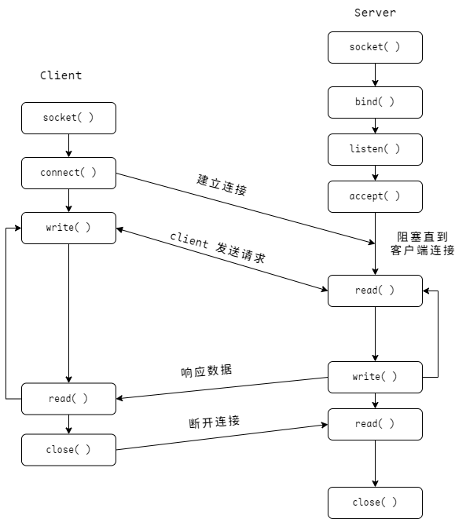
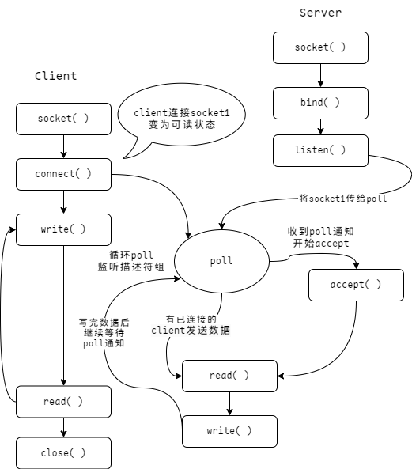

# Echo TCP Server

我们来进行编写一个小小的示例———— Echo TCP Server(TCP 回显 server)，帮助我们理解更多的内容。

> 代码一共也就一百行左右，简洁但不简单！

## 前置知识

### Socket

Socket（套接字）是计算机网络中用于实现不同计算机或同一台计算机上的不同进程之间的通信的一种技术。它提供了一种标准的 API，程序员可以使用这个 API 来编写网络应用程序。

一个 Socket 由三个部分组成：**协议**、**本地地址**和**远程地址**，协议决定了 Socket 的类型和通信方式，例如 TCP 或 UDP，本地地址是 Socket 绑定的网络接口和端口号，远程地址是 Socket 连接的目标网络接口和端口号。

除了常见的 **TCP** 和 **UDP** 外，还有一种叫做 **Unix Socket**，用于在同一台机器上的不同进程间进行通信，并不使用网络协议栈，而是直接在内核中传递数据，比 TCP 和 UDP 更加高效。

### IO 多路复用

**I/O 多路复用**是一种允许一个进程同时监视多个 I/O 通道（例如，_socket_、*文件描述符*等），并知道哪个通道可以进行读写操作的技术。这样，一个进程就可以同时处理多个 I/O 操作，而无需为每个 I/O 操作启动一个新的线程或进程。

> I/O 多路复用的主要优点是提高了程序的效率。如果没有 I/O 多路复用，程序可能需要为每个 I/O 操作创建一个新的线程或进程，这会消耗大量的系统资源。通过使用 I/O 多路复用，程序可以在一个单独的线程或进程中处理多个 I/O 操作，从而减少了系统资源的使用。

I/O 多路复用的常见实现包括 select、poll 和 epoll 等系统调用。这些系统调用允许程序指定一个文件描述符列表，并等待其中任何一个文件描述符准备好进行 I/O 操作。当一个或多个文件描述符准备好时，系统调用返回，程序就可以进行相应的读或写操作。

## 思路讲解

目标：实现一个单线程基于 `poll` 的 **echo server**。

常规的 socket 编程流程为：

1. `socket( )`
2. `bind( )`
3. `listen( )`
4. `accept( )`
5. `read( )`
6. `write( )`
7. `close( )`

以上是一个常规的 TCP server 的运作图，但是缺点也很明显，那就是这样运行的话 server 一次只能处理一个连接，无法实现并发连接。

故我们引入 `poll`，它是 POSIX 标准之一，允许我们通知内核替我们监听多个描述符（此处指代 socket 描述符），以一种订阅的方案来监听一组描述符，直到描述符可读或写时通知进程就绪的描述符数量。

::: info 🅿️ 提示

严格来说，**poll** 已经算是一门“过时”的技术，在 linux 平台它被 **epoll** 取代，BSD 系统（包括 mac）则使用 **kqueue**，而 windows 使用 **IOCP（I/O Completion Ports）** 和 **Overlapped I/O**。

WSAPoll For Windows: [WSAPoll function](https://learn.microsoft.com/en-us/windows/win32/api/winsock2/nf-winsock2-wsapoll)

Poll For Linux: [poll(2) — Linux manual page](https://man7.org/linux/man-pages/man2/poll.2.html)

:::

以下是使用 `poll` 后的运作图：

## 实战

为了同时兼容 linux 和 windows，我们需要利用一下 zig 的 `builtin` 包来判断构建目标来决定使用的函数（poll 在 windows 上的实现不完全标准）。

完整的代码在 [Github](https://github.com/zigcc/zig-course/tree/main/course/code/release/echo_tcp_server.zig)，测试用的客户端可以使用 _telent_（windows、linux、mac 均可用）。

_server_ 监听端口的实现：

<<< @/code/release/echo_tcp_server.zig#listen

定义一些必要的数据：

<<< @/code/release/echo_tcp_server.zig#data

处理客户端发送的数据的实现：

<<< @/code/release/echo_tcp_server.zig#exist-connections

处理新连接的实现：

<<< @/code/release/echo_tcp_server.zig#new-connection
