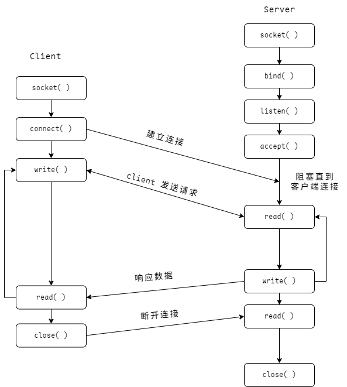

# Echo TCP Server

我们来编写一个小小的示例———— Echo TCP Server(TCP 回显 server)，帮助我们理解更多的内容。

> 代码一共也就一百行左右，简洁但不简单！

## 前置知识

### Socket

Socket（套接字）是计算机网络中用于实现不同计算机或同一台计算机上的不同进程之间的通信的一种技术。它提供了一种标准的 API，程序员可以使用这个 API 来编写网络应用程序。

一个 Socket 由三个部分组成：**协议**、**本地地址**和**远程地址**，协议决定了 Socket 的类型和通信方式，例如 TCP 或 UDP，本地地址是 Socket 绑定的网络接口和端口号，远程地址是 Socket 连接的目标网络接口和端口号。

除了常见的 **TCP** 和 **UDP** 外，还有一种叫做 **Unix Socket**，用于在同一台机器上的不同进程间进行通信，并不使用网络协议栈，而是直接在内核中传递数据，比 TCP 和 UDP 更加高效。

### Zig 0.16 的 `std.Io`

Zig 0.16 的网络示例优先使用标准库的 `std.Io` 接口。`std.Io.Threaded` 提供 I/O 后端；本例使用单线程模式，配合 `std.Io.net` 完成监听、接受连接、读写和关闭。

## 思路讲解

目标：使用 `std.Io` 实现一个简单的单线程、单客户端 **echo server**。

常规的 socket 编程流程为：

1. `socket( )`
2. `bind( )`
3. `listen( )`
4. `accept( )`
5. `read( )`
6. `write( )`
7. `close( )`

上图就是本例采用的流程：服务器每次 `accept` 一个客户端，在同一线程内读取数据并写回，客户端断开后再等待下一个连接。因此它是一个串行示例，不是并发服务器。

## 实战

代码使用 `std.Io.Threaded` 的单线程后端和 `std.Io.net`，监听本机 `8080` 端口。完整的代码在 [Github](https://github.com/zigcc/zig-course/tree/main/course/code/release/echo_tcp_server.zig)，测试用的客户端可以使用 _telnet_（windows、linux、mac 均可用）。

初始化 I/O 后端并监听端口的实现：

<<< @/code/release/echo_tcp_server.zig#listen

等待新客户端连接的实现：

<<< @/code/release/echo_tcp_server.zig#new-connection

处理当前客户端数据的实现：

<<< @/code/release/echo_tcp_server.zig#exist-connections
